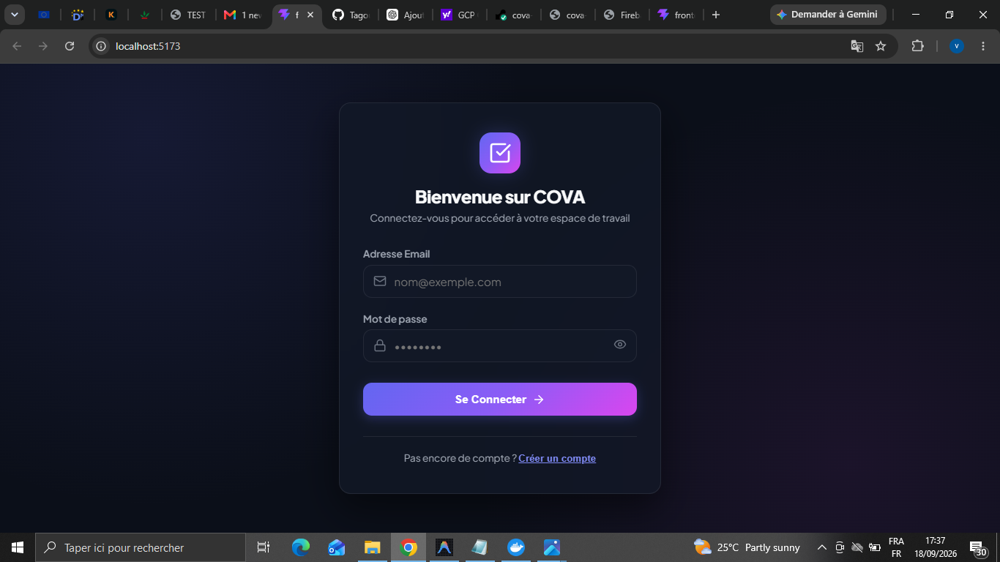
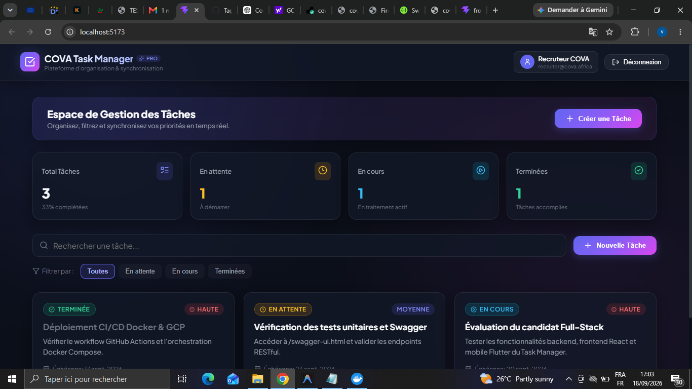

# 🚀 COVA Task Manager - Application Full-Stack & Mobile

[](https://spring.io/projects/spring-boot)
[](https://react.dev/)
[](https://vitejs.dev/)
[](https://flutter.dev/)
[](https://www.docker.com/)
[]()

---

## 📌 Présentation du Projet

**COVA Task Manager** est une mini-application full-stack et mobile de gestion de tâches développée pour le test de recrutement Développeur Full-Stack chez **COVA Cameroun**.

Elle permet à un utilisateur de :
- **Créer un compte et se connecter** de manière sécurisée via des jetons **JWT (JSON Web Tokens)**.
- **Ajouter, modifier, filtrer et supprimer des tâches** en temps réel.
- **Visualiser ses tâches** avec filtrage par statut (`PENDING`, `IN_PROGRESS`, `COMPLETED`), priorité (`LOW`, `MEDIUM`, `HIGH`) et recherche par mot-clé.
- **Synchroniser les données** de façon transparente entre l'application Web React et l'application Mobile Flutter grâce à l'API Spring Boot.
- **Automatiser le build, les tests et le déploiement** via un pipeline **GitHub Actions CI/CD** prêt pour **Google Cloud Platform (Cloud Run)**.

---

## 🏗️ Architecture & Choix Techniques

```
cova-task-manager/
├── backend/            # API RESTful Java 17 Spring Boot + Spring Security JWT + JPA
├── frontend/           # Application Web React + Vite + TypeScript (TSX)
├── mobile/             # Application Mobile Flutter + Dart (HTTP + SharedPreferences)
├── .github/workflows/  # Pipeline CI/CD automatisé (GitHub Actions -> GCP Cloud Run)
├── docker-compose.yml  # Orchestration locale Docker (MySQL 8.0 + Backend Spring Boot)
└── README.md
```

### 🔹 Domaine Backend API
- **Langage & Framework** : Java 17, Spring Boot 3.2.3, Spring Data JPA.
- **Sécurité & Auth** : Spring Security 6 avec filtre d'authentification **JWT (JJWT 0.12.5)** stateless et hachage des mots de passe avec **BCrypt**.
- **Base de données** : MySQL 8.0 pour la production/Docker avec fallback automatique sur **H2 In-Memory Database** pour un démarrage local rapide sans dépendance externe.
- **Documentation API** : Springdoc OpenAPI 3 / **Swagger UI** (`/swagger-ui.html`).
- **Tests** : Tests unitaires et d'intégration Spring Boot avec JUnit 5 et MockMvc.

### 🔹 Domaine Frontend Web
- **Framework & Tooling** : React 19, Vite 8, TypeScript (TSX).
- **Design & UI** : Vanilla CSS moderne avec thème sombre Glassmorphic (accents indigo/violet, micro-animations, cartes de statistiques, modales interactives, toasts de notification).
- **Gestion des données** : Context API (`AuthContext`), API fetch wrapper avec interception automatique des en-têtes `Authorization: Bearer <token>`.

### 🔹 Domaine Mobile (Bonus)
- **Framework** : Flutter 3.x (Dart).
- **Consommation API** : Package `http` gérant l'authentification JWT et la persistance locale du jeton via `shared_preferences`.
- **Interface** : Thème sombre épuré avec `ListView`, `FilterChips`, `FloatingActionButton` et boîtes de dialogue réactives.

### 🔹 CI/CD & Déploiement (Bonus)
- **Conteneurisation** : `Dockerfile` multi-stage pour le backend Java et `Dockerfile` Nginx pour le frontend Web.
- **Pipeline CI/CD** : GitHub Actions (`.github/workflows/ci-cd.yml`) effectuant le test, le build JAR/static, la création d'images Docker et le déploiement automatisé sur **Google Cloud Run**.

---

## ⚡ Instructions d'installation et d'exécution locale

### Préréquis
- **Java JDK 17** ou plus récent.
- **Apache Maven 3.8+**.
- **Node.js 20+** et `npm`.
- *(Optionnel)* **Docker** & **Docker Compose**.
- *(Optionnel pour le mobile)* **Flutter SDK 3.x**.

---

### 1️⃣ Option 1 : Lancement rapide via Docker Compose (Recommandé)

Pour démarrer l'ensemble des services (MySQL 8.0 + Backend Spring Boot) en une seule commande :

```bash
git clone <URL_DU_REPO_GITHUB>
cd cova-task-manager
docker-compose up --build
```
L'API Backend sera accessible sur `http://localhost:8080`.

---

### 2️⃣ Option 2 : Lancement Manuel composant par composant

#### A. Démarrer le Backend Spring Boot API
```bash
cd backend
mvn spring-boot:run
```
- API REST : `http://localhost:8080/api`
- Swagger UI Documentation : `http://localhost:8080/swagger-ui.html`
- Console H2 : `http://localhost:8080/h2-console`

Exécuter la suite de tests backend :
```bash
mvn clean test
```

#### B. Démarrer le Frontend Web React (Vite)
Dans un nouveau terminal :
```bash
cd frontend
npm install
npm run dev
```
- L'application Web s'ouvrira sur `http://localhost:5173`.

#### C. Démarrer l'application Mobile Flutter
Dans un troisième terminal :
```bash
cd mobile
flutter pub get
flutter run -d chrome   # Pour lancer le rendu mobile dans votre navigateur Chrome
```
*(ou `flutter run` pour lancer sur émulateur Android).*

---

## 📑 Endpoints de l'API RESTful

| Méthode | Endpoint | Description | Auth Requise |
| :--- | :--- | :--- | :--- |
| `POST` | `/api/auth/register` | Inscription d'un nouvel utilisateur | ❌ Non |
| `POST` | `/api/auth/login` | Connexion et génération du jeton JWT | ❌ Non |
| `GET` | `/api/auth/me` | Récupération du profil utilisateur connecté | ✅ Oui (Bearer) |
| `GET` | `/api/tasks` | Liste des tâches de l'utilisateur (`?status=...&search=...`) | ✅ Oui (Bearer) |
| `GET` | `/api/tasks/{id}` | Obtenir le détail d'une tâche | ✅ Oui (Bearer) |
| `POST` | `/api/tasks` | Création d'une nouvelle tâche | ✅ Oui (Bearer) |
| `PUT` | `/api/tasks/{id}` | Modification d'une tâche | ✅ Oui (Bearer) |
| `DELETE` | `/api/tasks/{id}` | Suppression d'une tâche | ✅ Oui (Bearer) |

---

## 🛢️ Schéma de la Base de Données

```
+------------------------------------+       +------------------------------------+
|               USERS                |       |               TASKS                |
+------------------------------------+       +------------------------------------+
| id (PK, BigInt, AutoIncrement)    |<-----\ | id (PK, BigInt, AutoIncrement)    |
| email (Varchar, Unique, NotNull)   |      \ | title (Varchar, NotNull)           |
| password (Varchar, BCrypt)         |       \| description (Text)                |
| full_name (Varchar, NotNull)       |        | status (Enum: PENDING, IN_PROGRESS)|
| created_at (Timestamp)             |        | priority (Enum: LOW, MEDIUM, HIGH) |
| updated_at (Timestamp)             |        | due_date (Timestamp)               |
+------------------------------------+        | user_id (FK -> users.id)           |
                                              | created_at (Timestamp)             |
                                              | updated_at (Timestamp)             |
                                              +------------------------------------+
```

---

## 🔄 Pipeline CI/CD & Stratégie de Déploiement

### 1. Pipeline CI/CD automatisé (GitHub Actions)
Le fichier `.github/workflows/ci-cd.yml` orchestre la validation continue sur GitHub lors de chaque `push` :
- **Job Backend CI** : Compilation Java 17, exécution automatisée des tests unitaires/intégration Spring Boot (`mvn clean package`) et création de l'image Docker Backend.
- **Job Frontend CI** : Configuration de Node.js 20, compilation de production React (`npm run build`) et création de l'image Docker Nginx Frontend.
- **Job Déploiement GCP** : Prêt pour l'instanciation automatisée sur **Google Cloud Run**.

### 2. Hébergement en Direct (Bonus Live Deployments)
Afin de fournir des liens de démonstration immédiatement accessibles sur le web :
- **Frontend Web App** : Hébergé en direct sur **Firebase Hosting** (`https://cova-task-manager-app.web.app`).
- **Backend REST API** : Hébergé en direct sur **Render Cloud** (`https://cova-task-manager.onrender.com/api`).
- **Orchestration Locale** : Fichier `docker-compose.yml` permettant d'exécuter MySQL 8.0 et l'API Spring Boot localement en un clic.

---

## 📷 Captures d'écran de l'Application (Screenshots)

### 1. Page de Connexion & Inscription


### 2. Tableau de Bord & Statistiques


### 3. Liste des Tâches & Filtrage


### 4. Fenêtre de Création d'une Tâche


### 5. Modification d'une Tâche Existante


---

## 🌐 Liens d'Accès & Déploiement Cloud (Démos en Direct)

### 🚀 Application Web & API Déployées en Direct (Live Links)
- 🔗 **Application Web Frontend (Firebase Hosting)** : [https://cova-task-manager-app.web.app](https://cova-task-manager-app.web.app)
- 🔗 **API Backend REST (Cloud Render)** : [https://cova-task-manager.onrender.com/api](https://cova-task-manager.onrender.com/api)
- 🔗 **Documentation Swagger UI (Live)** : [https://cova-task-manager.onrender.com/swagger-ui.html](https://cova-task-manager.onrender.com/swagger-ui.html)

### 🔑 Identifiants du Compte Démo (Accès Immédiat Recruteurs)
Pour tester immédiatement l'application en ligne ou en local sans créer de compte :
- 📧 **Email** : `recruiter@cova.africa`
- 🔒 **Mot de passe** : `CovaRecruit2026!`

### 💻 Accès Local Alternative (Optionnel)
- 🔗 **Application Web Frontend** : [http://localhost:5173](http://localhost:5173)
- 🔗 **API Backend REST** : [http://localhost:8080/api](http://localhost:8080/api)
- 🔗 **Documentation Swagger UI** : [http://localhost:8080/swagger-ui.html](http://localhost:8080/swagger-ui.html)

---

## ⚙️ CI/CD & Déploiement DevOps (GCP Cloud Run & Docker)

Le projet est entièrement configuré avec les meilleures pratiques DevOps :
- **GitHub Actions Pipeline** (`.github/workflows/ci-cd.yml`) : Pipeline automatisé effectuant le build, les tests unitaires Spring Boot/Maven, la compilation React et le build des conteneurs Docker.
- **Google Cloud Run Ready** : Déploiement automatisé multi-stage sur GCP Cloud Run.
- **Docker Compose** (`docker-compose.yml`) : Orchestration locale avec MySQL 8.0 + Backend Spring Boot.


---

## ✉️ Auteur & Contact

Développé dans le cadre du test de recrutement **COVA Cameroun**.
- **Contact COVA** : operations@cova.africa / contact@cova.africa

